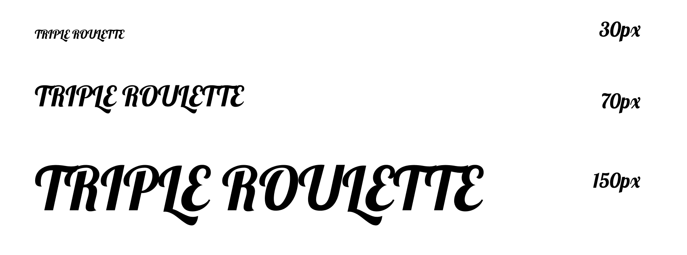
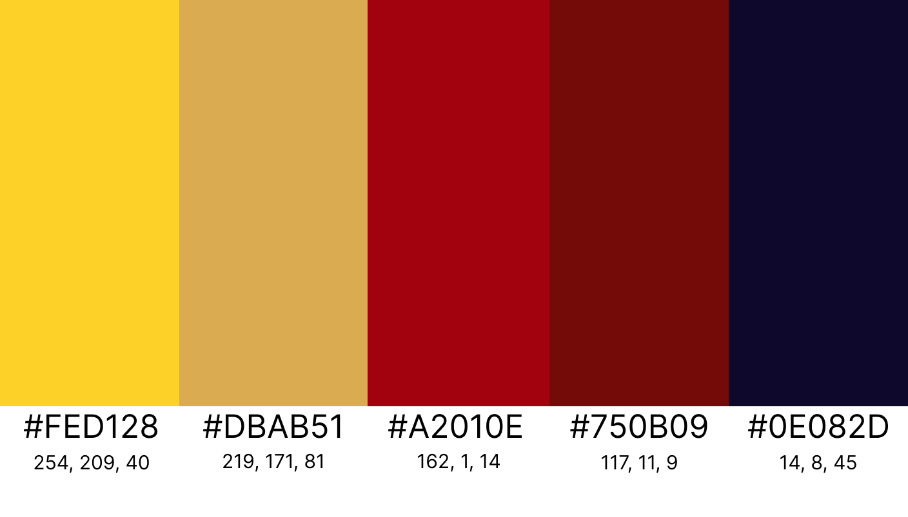
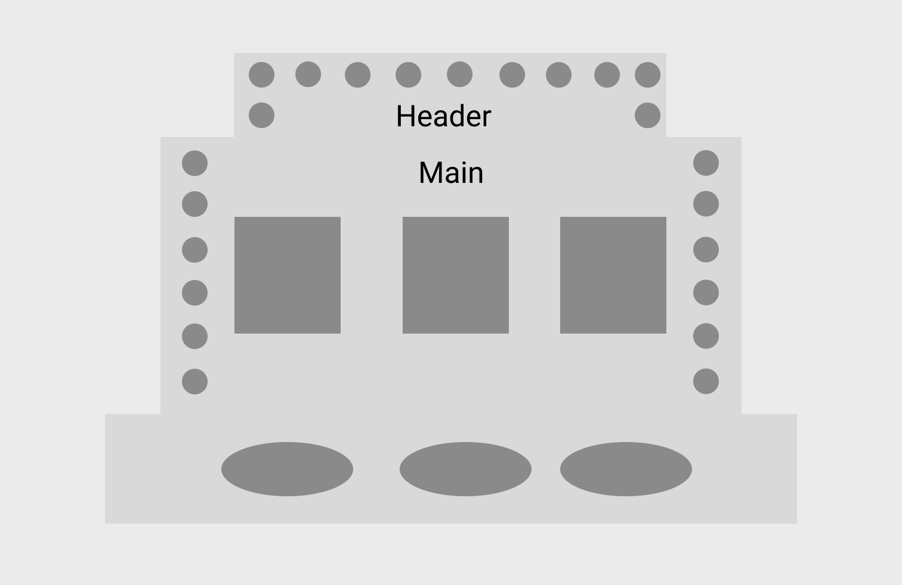
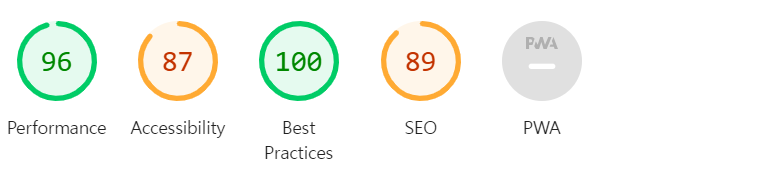
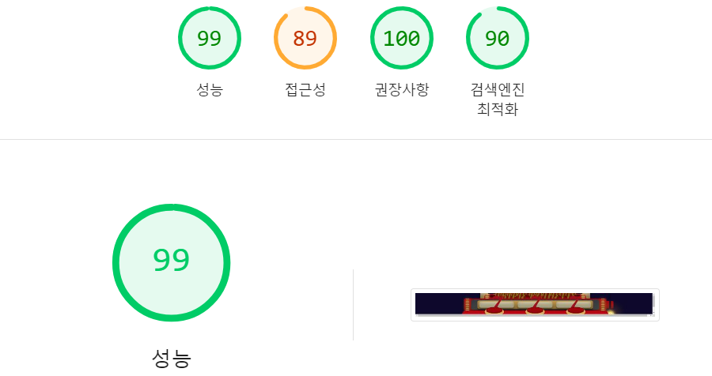

## Team Member 👥
<table>
  <tr>
    <td align="center">
      <a href="https://github.com/qbobl5">
        <b>팀장 김혜빈</b>
      </a>
    </td>
    <td align="center">
      <a href="https://github.com/hyeri1126">
        <b>팀원 류혜리</b>
      </a>
    </td>
    <td align="center">
      <a href="https://github.com/doyi0107">
        <b>팀원 이도이</b>
      </a>
    </td>
  </tr>
  <tr>
    <td align="center">
      <a href="https://github.com/qbobl5">
        
      </a>
    </td>
    <td align="center">
      <a href="https://github.com/hyeri1126">
        
      </a>
    </td>
    <td align="center">
      <a href="https://github.com/doyi0107">
        
      </a>
    </td>
  </tr>
   
  <tr>
    <td align="center">
      깃 관리<br>
      룰렛 스핀 알고리즘 구현<br>
    </td>
    <td align="center">
      인트로 및 메인 배경 구현 <br>     
      서비스 발표<br>
    </td>
    <td align="center">
      메인 및 모달 UI 구현<br>
      반응형 구현 
    </td>
  </tr>
</table>

<br />

## Triple Roulette 🎰
> ‘Triple Roulette’은 **3개의 슬롯으로 이루어진 게임**으로, <br />
각 슬롯을 멈추며 나오는 단어들을 조합해 **랜덤한 문장을 생성할 수 있는 웹 서비스**입니다.<br />
🔗 Demo: [Game Start!](https://woorifisa-service-dev-3rd.github.io/frontend-1st-triple_roulette/)
<br />

## Service Introduction 👀
 1. **Intro** 
<p align="left">
  
</p>

 2. **Main-슬롯 스핀 기능**
<p align="left">
  
</p>

 3. **Main-주제 선택**
<p align="left">
  
</p>

 4. **Main-버튼 클릭 시**
<p align="left">
  
</p>

 5. **Main-게임 설명 UI**
<p align="left">
  
</p>

 6. **전체 반응형 및 잭팟**
<p align="left">
  
</p>


<br /><br />

## Team Rules 💬
### 1. Code
- class 명
  - '-'(하이픈) 사용하지 않고 '_'(언더바)로 통일
  - 자식 클래스명에 앞에 부모 클래스명 꼭 붙이기 **(ex) 'triple_header' -> 'triple_header_top'**
- prettier 사용하여 정렬 방식 통일
### 2. Branch
- feature branch 에서 main branch 로 직접적인 pull request 요청 금지
- dev branch 로 pull request 요청 시 적어도 1명의 승인이 있어야 merge 가능
- branch 이름은 feat/{feature name}-{user name} 으로 통일 **(ex) feat/button-qbobl5**
### 3. Commit Message
* `feat` (feature) 새로운 기능을 추가할 때 사용
* `fix` 오류를 수정할 때 사용
* `docs` 문서를 수정할 때 사용
* `refactor` 코드 리팩토링을 할 때 사용
* `rename` 파일 혹은 폴더명을 수정할 때 사용
* `remove` 파일을 삭제할 때 사용
* **(ex) feat: button 추가**
### 4. ESlint 규칙
```json
{
  "rules": {
    "quotes": ["error", "single"], 
    "semi": ["error", "always"], 
    "no-console": "warn", 
    "prefer-const": "error", 
    "no-multiple-empty-lines": ["error", { "max": 1 }], 
  }
}
```
- `quotes`
  - **적용 이유** : 일관된 따옴표 스타일을 유지하여 코드 가독성을 높이고, 팀원 간 코드 스타일 차이에 의한 불필요한 충돌을 줄임.
- `semi`
  - **적용 이유** : 모든 문장 끝에 세미콜론을 추가하여 코드가 자동으로 수정되는 경우 예기치 않은 오류를 방지. 
- `no-console`
  - **적용 이유** : console.log는 디버깅 용도로만 사용되며, 배포용 코드에서는 불필요한 로그가 남지 않도록 하기 위해 경고. 클린 코드와 성능 최적화에 도움.
- `prefer-const`
  - **적용 이유** : 재할당이 일어나지 않는 변수는 const로 선언하여 의도를 명확히 하고, 불필요한 재할당을 방지하여 코드의 안정성과 예측 가능성을 높임.
- `no-multiple-empty-lines`
  - **적용 이유** : 여러 개의 빈 줄을 제한하여 코드의 불필요한 공백을 줄이고, 코드가 깔끔하고 일관성 있게 유지.

<br />

## UI Style Gide 💻
### 1. Font
#### `Lobster`

### 2. Color Graph

### 3. Layout

### 4. LightHouse
#### 개선 전

#### 개선 후


